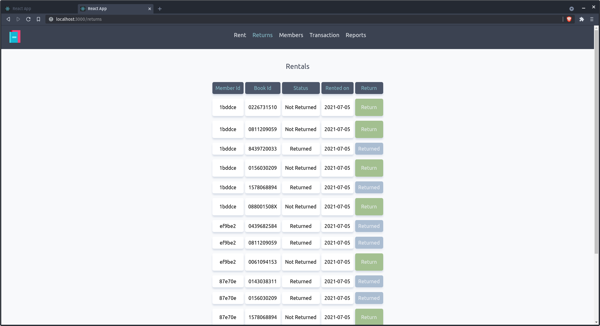
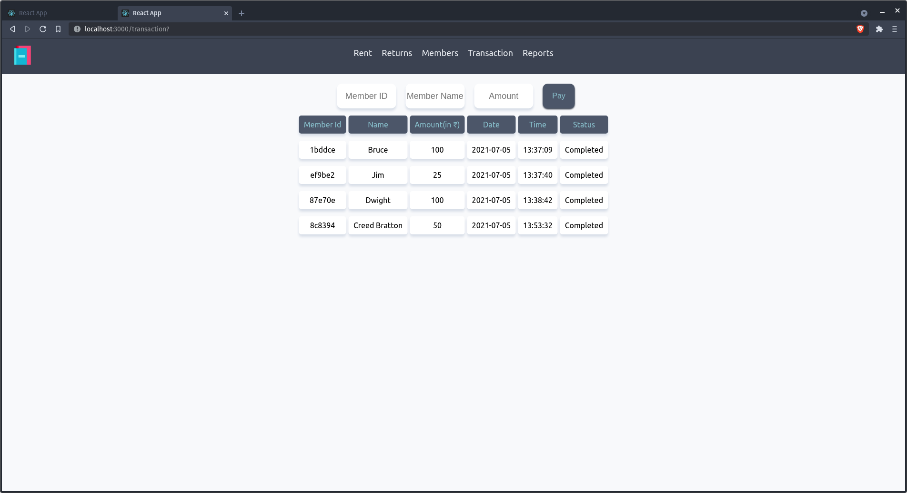

# Library management application for librarian

* Check more info on api: [frappe.api](https://frappe.io/dev-hiring-test)

## Requirements
```
ReactJS
Python-Flask
```

## Build project
```
cd Library/library-client
npm install
npm start

# open new terminal

cd Library/library-server
pip install -r requirements or pip3 install -r requirements
python3 main.py
```

## Features
* Search and rent books


* Issue book returns from members



* Add and remove members


* Make transactions



* Reports


